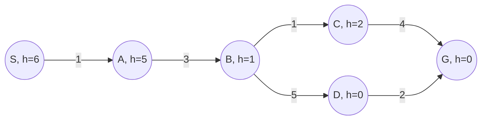



# INFORMED SEARCH
{:.no_toc}
---
## Table Of Contents
{:.no_toc.text-delta}
- TOC
{:toc}
---

<!-- STATE-SPACE FORMULATION ---------------------------------------------------------------------->
## State Space Formulation

It is training day for Pacbabies, also known as Hungry Running Maze Games day. Each of $$k$$
Pacbabies starts in its own assigned start location $$s_i$$ in a large maze of size $$M \times N$$
and must return to its own Pacdad who is waiting patiently but proudly at $$g_i$$ along the way,
the Pacbabies must, between them, eat all the dots in the maze.

At each step, all $$k$$ Pacbabies move one unit to any open adjacent square. The only legal actions
are *Up, Down, Left, or Right*. It is illegal for a Pacbaby to wait in a square, attempt to move
into a wall, or attempt to occupy the same square as another Pacbaby. To set a record, the
Pacbabies must find an optimal collective solution.

- Define a minimal state space representation for this problem.
> 

>    
<b>Solution</b>

>     
>    
The state space representation should exhaustively collect all possible configurations of
>    world states, taking into account only the elements that could possibly change from one
>    moment to the next.

>
>    For this problem, the world states are the possible configurations of the maze and its
>    elements, and the only elements that could change from moment to moment are:
> 
>    <ul>
>    <li>The (unknown) positions of the food pellets, as they could exist or not, or exist and
>        then stop existing (being eaten)</li>
>    <li>The positions of the Pacbabies as they traverse the maze</li>
>    </ul>
> 
>    Other things like the possible directions of Pacbabies, help create new states but, per se,
>    are not visible world configurations, nor are they variable.
> 

- How large is the state space?
> 

>    
<b>Solution</b>

> 
>    Given the above descriptions:
>    <ul>
>    <li>The food pellets might exist or not exist in each cell of the maze, creating
>        \(2^{mn}\) possible food configurations.</li>
>    <li>The Pacbabies can possibly traverse all cells in the maze of size \(mn\). Since there
>        are \(k\) Pacbabies, there are \(O\pars{(mn)^k}\) Pacbabies' position configurations.</li>
>    </ul>
> 
>    Creating a total of \(O\pars{(mn)^k \, 2^{mn}}\) world configurations.
> 

- What's the maximum branching factor?
> 

>    
<b>Solution</b>

>
>    The branching factor of a search tree is determined by the possible actions that could create
>    new states. Since the only actions available are the Pacbabies' directions, we have an action
>    space of 4, and as we have \(k\) Pacbabies, the branching factor has a size of \(4^k\).
> 

---

<!-- HEURISTICS ----------------------------------------------------------------------------------->
## Heuristics

You'd like to choose two heuristic functions, $$f$$ and $$g$$, such that max$$(f(n), g(n))$$ is an
admissible heuristic.

- What is a sufficient condition on $$f$$ and $$g$$ for $$h$$ to be admissible?
> 

>    
<b>Solution</b>

>
>    Both, \(f\) and \(g\) have to be admissible.
> 

Now, you'd like to choose two heuristic functions such that
$$ h(n) = \alpha f(n) + (1 - \alpha) g(n) $$ is admissible for any value $$\alpha \in [0, 1]$$.

- What is a sufficient condition for $$h$$ to be admissible?
> 

>    
<b>Solution</b>

>
>    Given that \(\alpha \in [0, 1]\), \(h(n)\) can only vary within the bounds of \(f\) and \(g\);
>    so, it is sufficient that both are admissible heuristics.
> 

---

<!-- POWER PELLETS -------------------------------------------------------------------------------->
## Power Pellets

Consider a Pacman game where Pacman can eat 3 types of pellets:

* Normal pellets (n-pellets), which are worth 1 points.
* Decaying pellets (d-pellets), which are worth max$$(0, 5 - t)$$ points, where $$t$$ is time.
* Growing pellets (g-pellets), which are worth $$t$$ points, where $$t$$ is time.

The location and type of each pellet is fixed. The pellet's point value stops changing once eaten.

Pacman needs to find a path to win at least 10 points, but he also wants to minimize the distance
travelled. The cost between states is equal to the distance travelled.

* Which of the following must be included for a minimum, sufficient, state space?
- [ ] Pacman's location
- [ ] Location and type of each pellet
- [ ] How far Pacman has travelled
- [ ] Current time
- [ ] How many pellets Pacman has eaten, and the point value of each eaten pellet
- [ ] Total points Pacman has won
- [ ] Which pellets Pacman has eaten
> 

>    
<b>Solution</b>

>
>    <ul>
>    <li><b>Pacman's location</b>. You need to keep track of Pacman's position to be able to track
>       down the food pellets.</li>
>    <li><b>Current time</b>. Useful to compute the pellet's points, especially the g-pellets.</li>
>    <li><b>Total points Pacman has won</b>. This will help us reach the points goal.</li>
>    <li><b>Which pellets Pacman has eaten</b> Also useful to know what other pellets are we
>       missing to eat.</li>
>    </ul>
> 

- Explain whether each of the following heuristics are admissible.
1. Distance to the closest pellet, except if in the goal state; in which case, the heuristic
    value is 0.
1. Distance needed to win $$10 − x$$ points, determining the value of all pellets as if they
    were n-pellets.
1. Distance needed to win $$10 − x$$ points, determining the value of all pellets as if they
    were g-pellets (i.e. all pellet values will be $$t$$).
1. Distance needed to win $$10 − x$$ points, determining the value of all pellets as if they
    were d-pellets (i.e. all pellet values will be max$$(0, 5 − t)$$).
1. Distance needed to win $$10 − x$$ points assuming all pellets maintain current point value
    (g-pellets stop increasing in value and d-pellets stop decreasing in value).
1. None of the above
> 

>    
<b>Solution</b>

>
>    <ul>
>    <li><b>1. Admissible.</b> Optimistic if there are more than one pellets. If there is only one
>       pellet, it could be optimistic or precise, depending on the missing points, but not
>       pessimistic.</li>
>    <li><b>2. Inadmissible.</b> Pessimistic if there are only g-pellets.</li>
>    <li><b>3. Admissible.</b> Optimistic if there are no g-pellets; precise if there are only
>       g-pellets.</li>
>    <li><b>4. Inadmissible.</b> Pessimistic, as the value of d-pellets is decreasing, in contrast
>       to the other types.</li>
>    <li><b>5. Inadmissible.</b> Pessimistic if there are g-pellets, as their value increases and
>       may pass the points test when eaten.</li>
>    </ul>
> 

---

<!-- INCONSISTENT HEURISTICS ---------------------------------------------------------------------->
## Inconsistent Heuristics

The heuristic values for the graph below are not correct. For which single state (S, A, B, C, D, or
G) could you change the heuristic value to make everything admissible and consistent? What range of
values are possible to make this correction?

{:.text-center}
> 

>    
<b>Solution</b>

>
>    
There is a conflict between nodes <code>A</code> and <code>B</code> as \(5 - 1 > 3\), but
>    changing node <code>A</code> would make its edge with <code>Start</code> inconsistent. Then,
>    the change in heuristic value must happen in <code>B</code>, who must keep consistency with
>    <code>A</code>, <code>C</code> and <code>D</code>.

>
>    
Increasing its value to 2 will solve consistency with <code>A</code> without breaking the
>    others'. Increasing it to 3 will keep consistency as well.

>
>    As any other value would break consistency, the state needing change is <code>B</code>, with
>    a range \([2, 3]\).
> 

---