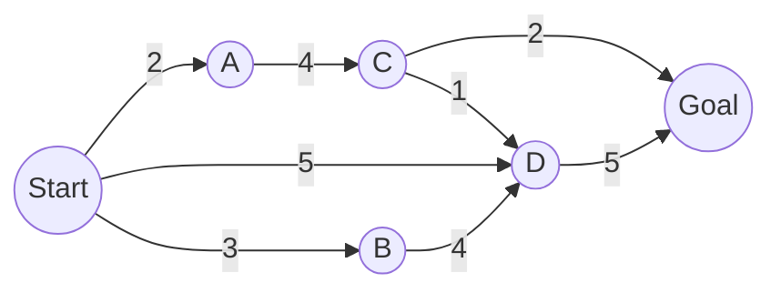



# UNINFORMED SEARCH
{:.no_toc}
---
## Table Of Contents
{:.no_toc.text-delta}
- TOC
{:toc}
---

<!-- SEARCH PROBLEM FORMULATION ------------------------------------------------------------------->
## Search Problem Formulation

Pacman bought a car, was speeding in Pac-City, and SpongeBob wasn’t able to catch him. Now Pacman
has run out of gas, his car has stopped, and he is currently hiding out at an undisclosed location.

In this problem, you are on the SpongeBob side, trying to catch Pacman!

There are still $$p$$ SpongeBob cars in the Pac-City of dimension $$m$$ by $$n$$. In this problem,
all SpongeBob cars can move, with two distinct integer controls: *throttle* and *steering*, but
Pacman has to stay stationary. Once one SpongeBob car takes an action which lands him in the same
grid as Pacman, Pacman will be arrested and the game ends.

**Throttle**: $$t_i \in \{1, 0, -1\}$$, corresponding to {*Gas, Coast, Brake*}. This controls the
**speed** of the car by determining its acceleration. The integer chosen here will be added to his
velocity for the next state. For example, if a SpongeBob car is currently driving at 5 grid/s and
chooses *Gas* (1) he will be traveling at 6 grid/s in the next turn.

**Steering**: $$s_i \in \{1, 0,−1\}$$, corresponding to {*Turn Left, Go Straight, Turn Right*}. This
controls the direction of the car. For example, if a SpongeBob car is facing North and chooses
*Turn Left*, it will be facing West in the next turn.

Suppose you can only control 1 SpongeBob car, and have absolutely no information about the
remainder of $$p − 1$$ SpongeBob cars, or where Pacman stopped to hide. Also, the SpongeBob cars
can travel up to 6 grid/s so $$0 \le 𝑣 \le 6$$ at all times.

- What is the tightest upper bound on the size of state space, if your goal is to use search to
plan a sequence of actions that guarantees Pacman is caught, no matter where Pacman is hiding, or
what actions other SpongeBob cars take. Please note that your state space representation must be
able to represent all states in the search space.
> 

>     
<b>Solution</b>

> 
>     For this problem, the size of the state space depends on the variable factors, which are:
>     <ul>
>         <li>The possible (unknown) location of Pacman. As it could be or not be in any of the grid
>         cells, in the worst case we'd need to traverse all grid locations and keep track of
>         whether we have visited each cell, leading to \(2^{mn}\) possibilities</li>
>         <li>The car could potentially traverse all grid locations before finding Pacman, leaving
>         \(mn\) possibilities for his travel</li>
>         <li>SpongBob's internal state could be any combination of its 7 speeds and 4
>         directions, resulting in 28 possible state combinations</li>
>     </ul>
>
>     Taking all of this into account, there could be \(O\pars{28mn \cdot 2^{mn}}\) possible world
>     states/configurations.
> 

- What is the maximum branching factor? Your answer may contain integers, $$m, n$$.
> 

>     
<b>Solution</b>

>
>     The branching factor depends on the number of actions available, which are <b>9</b>; 3 for
>     throttle, and 3 for steering.
> 

- Which DFS and BFS algorithms are guaranteed to return a path passing through all grid locations
on the grid, if one exists?
> 

>     
<b>Solution</b>

>
>     Depth-first graph search, Breadth-first tree search and Breadth-first graph search
> 

- Is Breadth-First Graph Search guaranteed to return the path with the shortest number of time
steps, if one exists?
> 

>     
<b>Solution</b>

>
>     Yes, as BFS is complete and optimal (in the depth of the solution).
> 

Now let’s suppose you can control all $$p$$ SpongeBob cars at the same time (and know all their
locations), but you still have no information about where Pacman stopped to hide.

- Now, you still want to search a sequence of actions such that the paths of $$p$$ SpongeBob car
combined pass through all $$m \times n$$ grid locations. What's the size of the state space?
> 

>     
<b>Solution</b>

>
>     An upper bound for the size is \(O\pars{(28mn)^p \cdot 2^{mn}}\). The visited combinations
>     are unaffected by the \(p\) cars, but as having one car results in \(O\pars{28mn}\) state
>     configurations, \(p\) cars would result in \(O\pars{(28mn)^p}\).
> 

- What's the branching factor considering $$p$$ cars?
> 

>     
<b>Solution</b>

>
>     As 1 car has 9 possible actions from where to choose its next movement, \(p\) cars will have
>     \(9^p\) possibilities.
> 

---

<!-- GRAPH SEARCH BY HAND ------------------------------------------------------------------------->
## Graph Search By Hand

{:.text-center}

For each of the following graph search strategies, work out the order in which states are expanded,
as well as the path returned by graph search. In all cases, assume ties resolve in such a way that
states with earlier alphabetical order are expanded first. Remember that in graph search, a state
is expanded only once.

<b>Note:</b> In order to reconstruct the paths from `Start` to `Goal`, I'll keep track of the
parent of each node, with `null` indicating the absence of a parent. For example `(A, S)` will
represent the node `A` with parent `S`.

- Depth-first search
> 

>     
<b>Solution</b>

>     
>     Depth-first search explores the deepest nodes first; as such, the exploration would be:
>     
>     <h4>Initialization</h4>
>     <dl>
>         <dt>Fringe</dt>
>         <dd><code>(Start, null)</code></dd>
>         <dt>Expanded</dt>
>         <dd><i>empty</i></dd>
>     </dl>
> 
>     <h4>Iteration 1</h4>
>     Pop <code>(Start, null)</code> and push <code>(A, Start)</code>, as it's its first child in
>     alphabetical order.
>     <dl>
>         <dt>Fringe</dt>
>         <dd><code>(A, Start)</code></dd>
>         <dt>Expanded</dt>
>         <dd><code>(Start, null)</code></dd>
>     </dl>
>     
>     <h4>Iteration 2</h4>
>     Pop <code>(A, Start)</code> and push <code>(C, A)</code>.
>     <dl>
>         <dt>Fringe</dt>
>         <dd><code>(C, A)</code></dd>
>         <dt>Expanded</dt>
>         <dd><code>(Start, null), (A, Start)</code></dd>
>     </dl>
> 
>     <h4>Iteration 3</h4>
>     Pop <code>(C, A)</code> and push <code>(D, C)</code>.
>     <dl>
>         <dt>Fringe</dt>
>         <dd><code>(D, C)</code></dd>
>         <dt>Expanded</dt>
>         <dd><code>(Start, null), (A, Start), (C, A)</code></dd>
>     </dl>
> 
>     <h4>Iteration 4</h4>
>     Pop <code>(D, C)</code> and push <code>(Goal, D)</code>.
>     <dl>
>         <dt>Fringe</dt>
>         <dd><code>(Goal, D)</code></dd>
>         <dt>Expanded</dt>
>         <dd><code>(Start, null), (A, Start), (C, A), (D, C)</code></dd>
>     </dl>
> 
>     <h4>Iteration 5</h4>
>     Pop <code>(Goal, D)</code> and, as it's a goal state, we finish.
>     <dl>
>         <dt>Fringe</dt>
>         <dd><i>empty</i></dd>
>         <dt>Expanded</dt>
>         <dd><code>(Start, null), (A, Start), (C, A), (D, C), (Goal, D)</code></dd>
>     </dl>
> 
>     
To reconstruct the path we'll start with the <code>Goal</code> whose parent is
>     <code>D</code>; then we'll add <code>D</code> and go to its parent <code>C</code> and so on
>     until we reach a node without any parent, and then we'll reverse the resulting list.

>
>     Following this procedure we can construct the path: <code>Start, A, C, D, Goal</code>.
> 

- Breadth-first search
> 

>     
<b>Solution</b>

>     
>     Breadth-first search explores one full level at a time.
> 
>     <h4>Initialization</h4>
>     <dl>
>         <dt>Fringe</dt>
>         <dd><code>(Start, null)</code></dd>
>         <dt>Expanded</dt>
>         <dd><i>empty</i></dd>
>     </dl>
> 
>     <h4>Iteration 1</h4>
>     Pop <code>(Start, null)</code> and push <code>(A, Start), (B, Start), (D, Start)</code>.
>     <dl>
>         <dt>Fringe</dt>
>         <dd><code>(A, Start), (B, Start), (D, Start)</code></dd>
>         <dt>Expanded</dt>
>         <dd><code>(Start, null)</code></dd>
>     </dl>
>     
>     <h4>Iteration 2</h4>
>     Pop <code>(A, start)</code> and push <code>(C, A)</code>.
>     <dl>
>         <dt>Fringe</dt>
>         <dd><code>(B, Start), (D, Start), (C, A)</code></dd>
>         <dt>Expanded</dt>
>         <dd><code>(Start, null), (A, Start)</code></dd>
>     </dl>
> 
>     <h4>Iteration 3</h4>
>     Pop <code>(B, Start)</code> and push <code>(D, B)</code>.
>     <dl>
>         <dt>Fringe</dt>
>         <dd><code>(D, Start), (C, A), (D, B)</code></dd>
>         <dt>Expanded</dt>
>         <dd><code>(Start, null), (A, Start), (B, Start)</code></dd>
>     </dl>
> 
>     <h4>Iteration 4</h4>
>     Pop <code>(D, Start)</code> and push <code>(Goal, D)</code>.
>     <dl>
>         <dt>Fringe</dt>
>         <dd><code>(C, A), (D, B), (Goal, D)</code></dd>
>         <dt>Expanded</dt>
>         <dd><code>(Start, null), (A, Start), (B, Start), (D, Start)</code></dd>
>     </dl>
> 
>     <h4>Iteration 5</h4>
>     Pop <code>(C, A)</code> and push <code>(D, C), (Goal, C)</code>.
>     <dl>
>         <dt>Fringe</dt>
>         <dd><code>(D, B), (Goal, D), (D, C), (Goal, C)</code></dd>
>         <dt>Expanded</dt>
>         <dd><code>(Start, null), (A, Start), (B, Start), (D, Start), (C, A)</code></dd>
>     </dl>
> 
>     <h4>Iteration 6, 7</h4>
>     In iteration 6 we popped <code>(D, B)</code> but, as <code>D</code> it's already been
>     visited, we just skip the iteration. In iteration 7, we pop <code>(Goal, D)</code> and, as
>     it's a goal state, the search is finished.
>     <dl>
>         <dt>Fringe</dt>
>         <dd><code>(D, C), (Goal, C)</code></dd>
>         <dt>Expanded</dt>
>         <dd><code>(Start, null), (A, Start), (B, Start), (D, Start), (C, A), (Goal, D)</code></dd>
>     </dl>
> 
>     Following the procedure of the <b>Depth-first search</b> part we reconstruct the path as:
>     <code>Start, D, Goal</code>.
> 

- Uniform-cost search
> 

>     
<b>Solution</b>

>
>     Uniform-cost search expands nodes with the minimum cost first. For this part, we'll also keep
>     track of the current cumulative cost of reaching a node.
>
>     <h4>Initialization</h4>
>     <dl>
>         <dt>Fringe</dt>
>         <dd><code>(Start, null, 0)</code></dd>
>         <dt>Expanded</dt>
>         <dd><i>empty</i></dd>
>     </dl>
>
>     <h4>Iteration 1</h4>
>     Pop <code>(Start, null, 0)</code> and push its children into the fringe, sorted by cost in
>     ascending order.
>     <dl>
>         <dt>Fringe</dt>
>         <dd><code>(A, Start, 2), (B, Start, 3), (D, Start, 5)</code></dd>
>         <dt>Expanded</dt>
>         <dd><code>(Start, null, 0)</code></dd>
>     </dl>
>
>     <h4>Iteration 2</h4>
>     Pop <code>(A, Start, 2)</code> and push its children into the fringe.
>     <dl>
>         <dt>Fringe</dt>
>         <dd><code>(B, Start, 3), (D, Start, 5), (C, A, 6)</code></dd>
>         <dt>Expanded</dt>
>         <dd><code>(Start, null, 0), (A, Start, 2)</code></dd>
>     </dl>
>
>     <h4>Iteration 3</h4>
>     Pop <code>(B, Start, 3)</code> and push its children into the fringe.
>     <dl>
>         <dt>Fringe</dt>
>         <dd><code>(D, Start, 5), (C, A, 6), (D, B, 7)</code></dd>
>         <dt>Expanded</dt>
>         <dd><code>(Start, null, 0), (A, Start, 2), (B, Start, 3)</code></dd>
>     </dl>
>
>     <h4>Iteration 4</h4>
>     Pop <code>(D, Start, 5)</code> and push its children into the fringe.
>     <dl>
>         <dt>Fringe</dt>
>         <dd><code>(C, A, 6), (D, B, 7), (Goal, D, 10)</code></dd>
>         <dt>Expanded</dt>
>         <dd><code>(Start, null, 0), (A, Start, 2), (B, Start, 3), (D, Start, 5)</code></dd>
>     </dl>
>
>     <h4>Iteration 5</h4>
>     Pop <code>(C, A, 6)</code> and push its children into the fringe.
>     <dl>
>         <dt>Fringe</dt>
>         <dd><code>(D, B, 7), (D, C, 7), (Goal, C, 8), (Goal, D, 10)</code></dd>
>         <dt>Expanded</dt>
>         <dd><code>(Start, null, 0), (A, Start, 2), (B, Start, 3), (D, Start, 5), (C, A, 6)
>         </code></dd>
>     </dl>
>
>     <h4>Iteration 6, 7, 8</h4>
>     
In iteration 6 and 7 we pop <code>(D, B, 7)</code> and <code>(D, C, 7)</code>,
>     respectively, but as <code>D</code> has already been expanded we just skip the iterations.

>
>     For iteration 8 we pop <code>(Goal, C, 8)</code>, and as it's a goal node we finish the search.
>     <dl>
>         <dt>Fringe</dt>
>         <dd><code>(Goal, D, 10)</code></dd>
>         <dt>Expanded</dt>
>         <dd><code>(Start, null, 0), (A, Start, 2), (B, Start, 3), (D, Start, 5), (C, A, 6), 
>         (Goal, C, 8)</code></dd>
>     </dl>
>
>     With this info we reconstruct the path <code>Start, A, C, Goal</code>, with cost 8.
> 

---

<!-- SEARCH PROPERTIES ------------------------------------------------------------------------->
## Search Properties

Consider a graph search problem where, for every action, the cost is at least $$\epsilon > 0$$, and
explain whether each of the following statements is true or false.

- Depth-first graph search is guaranteed to return an optimal solution.
> 

>    
<b>Solution</b>

> 
>    <b>False</b>. Among many other reasons, depth-first search does not even consider costs; thus,
>    there is no guarantee of optimality.
> 

- Breadth-first graph search is guaranteed to return an optimal solution.
> 

>    
<b>Solution</b>

> 
>    <b>False</b>. Breadth-first search does not even consider costs; thus, there is no guarantee
>    of optimality based on cost, only based on distance from start state.
> 

- Uniform-cost graph search is guaranteed to return an optimal solution.
> 

>    
<b>Solution</b>

> 
>    <b>True</b>. Uniform-cost search is complete and optimal, and its main purpose is to minimize
>    costs.
> 

---