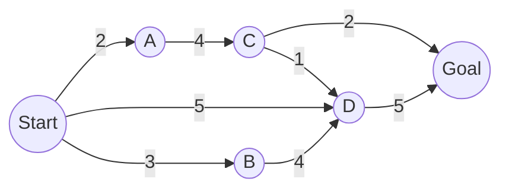

# UNINFORMED SEARCH
---

<!-- EXERCISE 1 -->
## Exercise 1

### Statement

{: .text-center }

For each of the following graph search strategies, work out the order in which states are expanded,
as well as the path returned by graph search. In all cases, assume ties resolve in such a way that
states with earlier alphabetical order are expanded first. Remember that in graph search, a state
is expanded only once.
1. Depth-first search
1. Breadth-first search
1. Uniform-cost search

    
My Solution

    
In order to reconstruct the path from <code>Start</code> to <code>Goal</code>, we'll keep
    track of the parents of each node, with <code>null</code> indicating the absence of a parent.
    For example <code>(A, S)</code> will represent the node <code>A</code> with parent
    <code>S</code>.

    
For brevity, the <b>Expanded</b> list will be treated also as the <b>Visited</b> set. In code
    implementation, they are usually two separate data structures.

    <ol>
        <!-- PART I -->
        <li>Depth-first search explores the deepest nodes first; as such, the exploration would be:

        <h4>Initialization</h4>
        <dl>
            <dt>Fringe</dt>
            <dd><code>(Start, null)</code></dd>
            <dt>Expanded</dt>
            <dd><i>empty</i></dd>
        </dl>

        <h4>Iteration 1</h4>
        Pop <code>(Start, null)</code> and push <code>(A, Start)</code>, as it's its first child in
        alphabetical order.
        <dl>
            <dt>Fringe</dt>
            <dd><code>(A, Start)</code></dd>
            <dt>Expanded</dt>
            <dd><code>(Start, null)</code></dd>
        </dl>
        
        <h4>Iteration 2</h4>
        Pop <code>(A, Start)</code> and push <code>(C, A)</code>.
        <dl>
            <dt>Fringe</dt>
            <dd><code>(C, A)</code></dd>
            <dt>Expanded</dt>
            <dd><code>(Start, null), (A, Start)</code></dd>
        </dl>

        <h4>Iteration 3</h4>
        Pop <code>(C, A)</code> and push <code>(D, C)</code>.
        <dl>
            <dt>Fringe</dt>
            <dd><code>(D, C)</code></dd>
            <dt>Expanded</dt>
            <dd><code>(Start, null), (A, Start), (C, A)</code></dd>
        </dl>

        <h4>Iteration 4</h4>
        Pop <code>(D, C)</code> and push <code>(Goal, D)</code>.
        <dl>
            <dt>Fringe</dt>
            <dd><code>(Goal, D)</code></dd>
            <dt>Expanded</dt>
            <dd><code>(Start, null), (A, Start), (C, A), (D, C)</code></dd>
        </dl>

        <h4>Iteration 5</h4>
        Pop <code>(Goal, D)</code> and, as it's a goal state, we finish.
        <dl>
            <dt>Fringe</dt>
            <dd><i>empty</i></dd>
            <dt>Expanded</dt>
            <dd><code>(Start, null), (A, Start), (C, A), (D, C), (Goal, D)</code></dd>
        </dl>

        The path is then reconstructed by traversing the parents, starting from <code>Goal</code>,
        and reversing the resulting list. As such, the returned path is
        <code>Start, A, C, D, Goal</code>.
        </li>
        

        <!-- PART 2 -->
        <li>Breadth-first search explores one full level at a time.

        <h4>Initialization</h4>
        <dl>
            <dt>Fringe</dt>
            <dd><code>(Start, null)</code></dd>
            <dt>Expanded</dt>
            <dd><i>empty</i></dd>
        </dl>

        <h4>Iteration 1</h4>
        Pop <code>(Start, null)</code> and push <code>(A, Start), (B, Start), (D, Start)</code>.
        <dl>
            <dt>Fringe</dt>
            <dd><code>(A, Start), (B, Start), (D, Start)</code></dd>
            <dt>Expanded</dt>
            <dd><code>(Start, null)</code></dd>
        </dl>
        
        <h4>Iteration 2</h4>
        Pop <code>(A, start)</code> and push <code>(C, A)</code>.
        <dl>
            <dt>Fringe</dt>
            <dd><code>(B, Start), (D, Start), (C, A)</code></dd>
            <dt>Expanded</dt>
            <dd><code>(Start, null), (A, Start)</code></dd>
        </dl>

        <h4>Iteration 3</h4>
        Pop <code>(B, Start)</code> and push <code>(D, B)</code>.
        <dl>
            <dt>Fringe</dt>
            <dd><code>(D, Start), (C, A), (D, B)</code></dd>
            <dt>Expanded</dt>
            <dd><code>(Start, null), (A, Start), (B, Start)</code></dd>
        </dl>

        <h4>Iteration 4</h4>
        Pop <code>(D, Start)</code> and push <code>(Goal, D)</code>.
        <dl>
            <dt>Fringe</dt>
            <dd><code>(C, A), (D, B), (Goal, D)</code></dd>
            <dt>Expanded</dt>
            <dd><code>(Start, null), (A, Start), (B, Start), (D, Start)</code></dd>
        </dl>

        <h4>Iteration 5</h4>
        Pop <code>(C, A)</code> and push <code>(D, C), (Goal, C)</code>.
        <dl>
            <dt>Fringe</dt>
            <dd><code>(D, B), (Goal, D), (D, C), (Goal, C)</code></dd>
            <dt>Expanded</dt>
            <dd><code>(Start, null), (A, Start), (B, Start), (D, Start), (C, A)</code></dd>
        </dl>

        <h4>Iteration 6, 7</h4>
        In iteration 6 we popped <code>(D, B)</code> but, as <code>D</code> it's already been
        visited, we just skip the iteration. In iteration 7, we pop <code>(Goal, D)</code> and, as
        it's a goal state, the search is finished.
        <dl>
            <dt>Fringe</dt>
            <dd><code>(D, C), (Goal, C)</code></dd>
            <dt>Expanded</dt>
            <dd><code>(Start, null), (A, Start), (B, Start), (D, Start), (C, A), (Goal, D)</code></dd>
        </dl>

        Then, we traverse the parent links starting from state <code>Goal</code> resulting in the
        path <code>Start, D, Goal</code>.
        </li>
    </ol>

---
