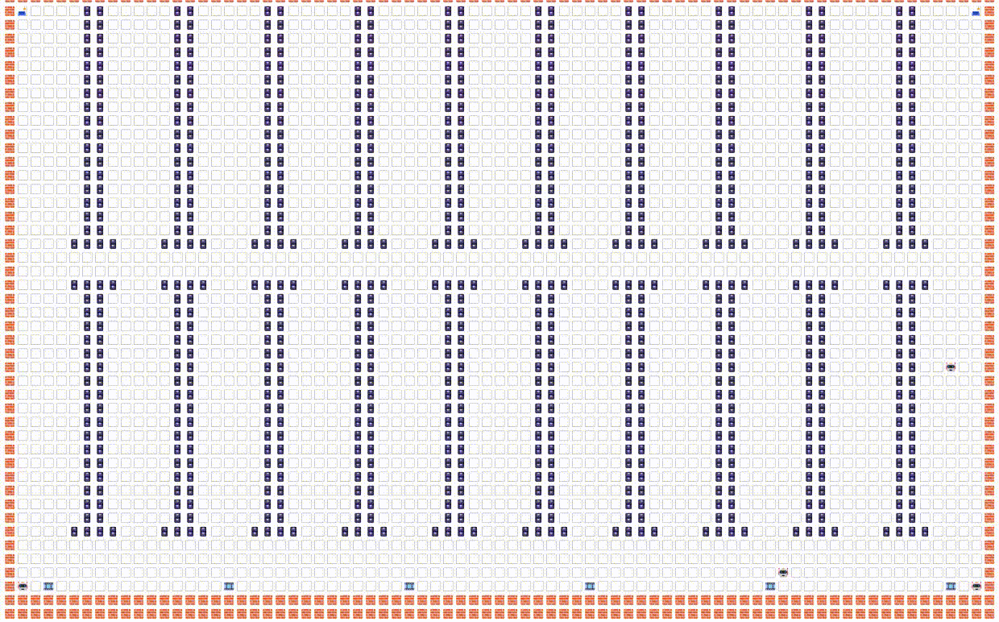


# AUTOMATED WAREHOUSE ADMINISTRATION

---
## Topics

* Dijkstra's shortest-path algorithm in a multi-agent environment.

---
## Overview

We are in a simulated discrete warehouse with $$N$$ robots at our disposal, all of  them controlled
from a central server.

Our task is to make use of these robots to pick packages from the racks and place them in their
designated conveyor belts, helping in a (out of scope) package delivery process.

---
## High-Level Expected Behavior

1. The simulation starts in a pre-set environment or warehouse, where there are $$M$$ fixed
   conveyor belts and $$N$$ resting locations. The (central) server then computes the optimal
   navigation policy to (independently) reach each belt and resting location, from any other
   location in the map (effectively creating $$M + N$$ policies).

2. Sometimes an order arrives, to pick $$K$$ packages available in the racks, each meant to be
   placed in a particular conveyor  belt. The  server computes the optimal navigation policy to
   (independently) reach each of them from any location in the warehouse.  

3. Each of the $$N$$ robots, distributed around the warehouse, is assigned a package to pick up
   and place in their assigned belt. The server computes these assignations based on:
   1. For each package, it computes the cost of reaching such item from the
     current robot location + the cost of reaching the target belt from the
     package location.
   2. Then, the robot is assigned the package of minimal cost.
   3. It picks another robot and repeats.

4. Once a robot's been assigned a package to transport, it starts navigating the warehouse,
   according to the pre-computed policies, disregarding collisions against walls and other robots.

5. When a robot has delivered its package, it is assigned a new one, if available; otherwise, it
   goes to any resting location until a new order arrives, and it's assigned a new package to
   transport.

---
## Implementation Details

1. The current implementation displays on the console, with emojis.
   
2. The current implementation is based on a single thread; thus, all agents run sequentially, in
   locksteps.

3. When assigning packages to robots, no particular order is assumed. Each robot is iterated
   sequentially, in the order they were created.

4. A new order is created when all robots have delivered their current packages.

---
## Short Demo

Icons:
* The *resting locations* are the icons on the corners
* The icons at the middle-bottom are the *conveyor belts*
* The lots of blue icons in the middle are the racks

---
## Possible Improvements

1. Manage each robot in its own thread.

2. Create optimal *robot-package* assignations.

3. Create a *continuous* map, then discretize it and run the simulation, for a better UI.

4. Manage collisions.